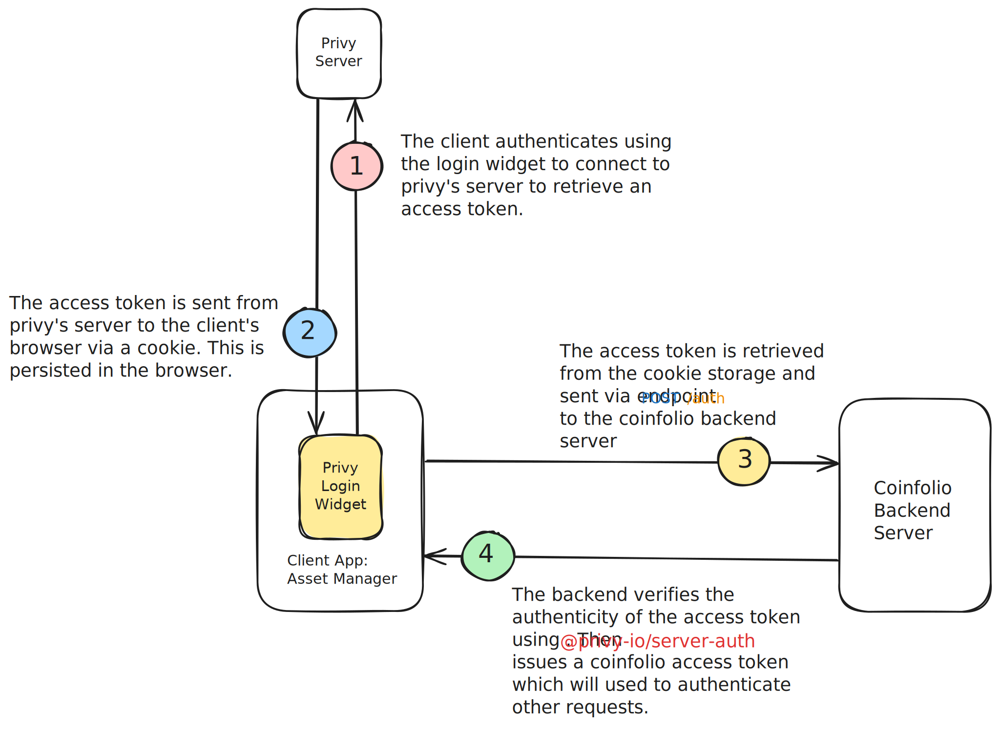

## Coinfolio API
Manage, track, and analyze the value of your digital assets, including NFTs (ERC-721) and FTs (ERC-20) tokens

---
## Getting Started

[Technologies](#technologies)

[Tools](#tools)

[Requirements](#requirements)

[Installations](#installations)

[API Documentation](#api-documentation)

[Architecture Diagram](#architecture-diagram)

[Author](#author)

## Technologies

- NestJS
- PostgreSQL
- Kysely
- TypeScript
- Docker
- Eslint
- Prettier
- JWT

## Tools
- [Moralis](https://developers.moralis.com/)
- [Privy.io](https://www.privy.io/)


## Requirements

- Node 18 LTS/Hydrogen (LTS is recommended)
- Yarn 1+ (1.22.19 is recommended)
- PostgreSQL 16 (LTS is recommended)


## Installations

- Clone the repository
  > Run the command below
  ```shell
  $ git clone https://github.com/coinfolio-io/coinfolio-api.git
  ```

- Install dependencies
  > Run the command below
  ```shell
  $ yarn install
  ```

- Create a `.env` file in the root of the project and add the following environment variables:
  ```shell
  $ cp .env.example .env
  ```
  <details>
    <summary>How to setup environment variables</summary>

    Below are the environment variables required for the project along with links to setup instructions for each service.

    ### Database Setup
    - `DB_HOST=localhost`
    - `DB_PORT=5432`
    - `DB_NAME=coinfolio`
    - `DB_USER=postgres`
    - `DB_PASSWORD=postgres`

    [Database Setup Guide](https://www.postgresql.org/download/)

    ### Moralis API Setup
    - `MORALIS_API_KEY=your-api-key-here`

    [Moralis Setup Guide](https://moralis.io/)

    ### JWT Configuration
    - `JWT_SECRET=your-jwt-secret`
    - `JWT_EXPIRES_IN=7d`
    - `JWT_ISSUER=coinfolio`
    - `JWT_AUDIENCE=coinfolio`

    [JWT Setup Guide](https://jwt.io/)

    ### Privy API Setup
    - `PRIVY_APP_ID=your-privy-app-id`
    - `PRIVY_APP_SECRET=your-privy-app-secret`

    [Privy Setup Guide](https://privy.io/)

    ### Redis Setup
    - `REDIS_HOST=localhost`
    - `REDIS_PORT=6379`

    [Redis Setup Guide](https://redis.io/docs/latest/operate/oss_and_stack/install/install-redis/)

  </details>

### Running Manually with Yarn
- Run migrations
  > Run the command below to create the database schema
  ```shell
  $ yarn run db:migrate
  ```
  Other commands:
    ```bash
      # create a new migration
      $ yarn run migrate:create <migration_name>
      # run the next migration
      $ yarn run db:migrate:up
      # rollback the last migration
      $ yarn run db:migrate:down
      # rollback all migrations
      yarn run db:rollback
      # create a new seed
      yarn run db:seed:make <seed_name>
      # run all seeds
      yarn run db:seed:run
    ```

- Run the project
  > Run the command below to start the project
  ```shell
  $ yarn run start:dev
  ```

- Navigate to `http://localhost:4000/api-docs` to access the API documentation


### Running with Docker

- Run migrations
  > Run the command below to create the database schema
  ```shell
  $ docker compose run coinfolio-api yarn run db:migrate
  ```

- Run the project
  > Run the command below to start the project
  ```shell
  $ docker compose up -d --build
  ```

- Navigate to `http://localhost:4000/api-docs` to access the API documentation


## API Documentation
Navigate to `http://localhost:4000/api-docs` to access the API documentation

## Architecture Diagram



## Author
- [Timi David Tejumola](https://linkedin.com/in/timitejumola)
